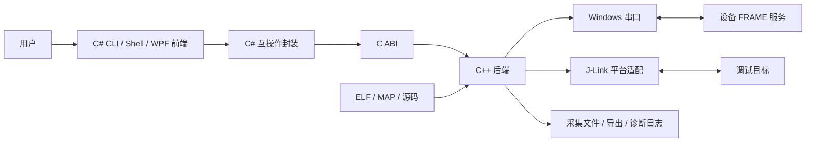
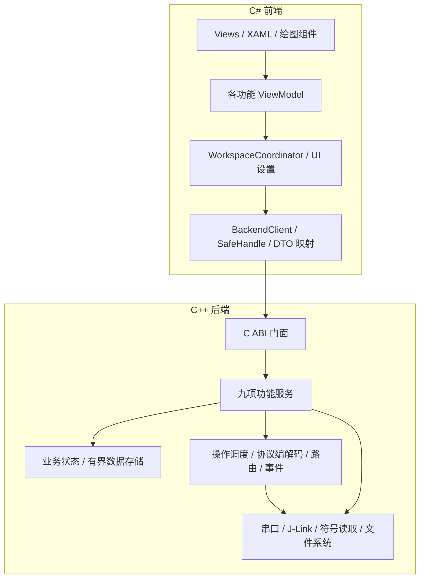
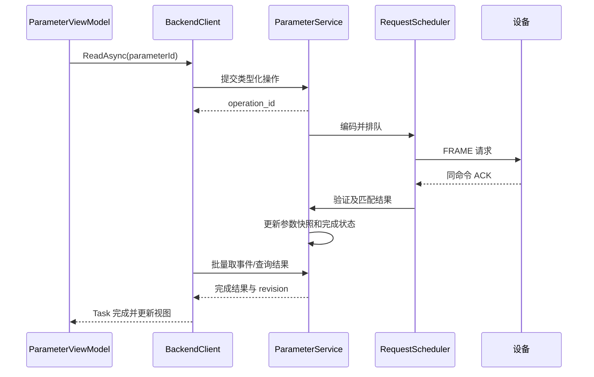

# FRAME C++ 后端与 C# 前端整体软件架构方案

> 日期：2026-09-08。状态：待实施的架构设计稿。
> 2026-09-08 更新：按 CLI / Shell 优先实施。本文描述详细设计目标；当前实现、接口和验收边界以 NATIVE_ARCHITECTURE.md、CLI_REFERENCE.md、NATIVE_VALIDATION.md 为准。旧 Python 应用和测试已移除。

## 1. Top Down 设计起点

### 1.1 系统目标

建立一个面向 Windows 的嵌入式设备调试桌面软件：用户通过串口完成调试、参数操作和设备数据观测，通过 J-Link 完成符号浏览及变量访问。C# 前端负责交互和呈现，C++ 后端负责设备会话、业务执行、协议、采集数据和平台访问。

设计按以下顺序展开：

1. 明确用户任务和交付范围。
2. 定义系统边界及质量目标。
3. 划分前端与后端责任。
4. 将后端拆成业务、数据、运行框架、平台适配，将前端拆成页面、视图模型、应用协调和互操作封装。
5. 定义跨层接口、数据模型、线程和生命周期。
6. 展开九项功能的执行流程及异常行为。
7. 将架构映射到工程目录、实施阶段与验收证据。

### 1.2 三条设计前提

- **实体**：设备会话、业务操作、采集数据集是后端实体；页面是这些实体的视图。
- **先验**：外部帧、符号文件和设备状态需要验证；发送成功与设备执行成功分别表示。
- **时间**：所有操作有结束条件；通信超时使用单调时钟；历史数据不因页面切换或重连而被误认为当前数据。

由此得到三项架构约束：缓冲和任务有上限、业务状态只有一个权威来源、异步结果携带会话与版本信息。

### 1.3 交付范围

| 编号 | 功能 | 本期包含的用户任务 |
|---|---|---|
| F01 | 串口调试 | 枚举、配置、连接、文本/HEX 收发、定时发送、接收显示和保存 |
| F02 | 参数读写 | 枚举参数、搜索、读取、写入、批量操作、上报配置 |
| F03 | 参数波形 | 参数实时值曲线、开始/暂停显示、历史视口、缩放、游标、导出 |
| F04 | 软件录波 Scope | 录波对象和通道查询、启动、触发、停止、复位、记录拉取和查看 |
| F05 | SFRA | 对象查询、扫频配置、启动/停止/复位、结果读取、幅相曲线和导出 |
| F06 | Perf | 信息/字典/统计/样本查询、采集控制、峰值复位、性能表格和趋势 |
| F07 | Trace | 使能/停止、记录流查看、时间轴、筛选、有限条件下的源码关联 |
| F08 | 链表顺序 | 注册链表目录、节点顺序和地址查询、可选符号解析 |
| F09 | J-Link | ELF/MAP/DWARF 浏览、设备连接、变量读取、RAM 写入、类型展开与源码定位 |

本期运行传输为串口与 J-Link。CAN、Ethernet、固件升级、Factory Mode、Black Box 不纳入本期交付。CLI 和交互式 Shell 是正式产品入口，优先于 UI 实现和验证。

“软件录波”指设备侧采样与触发、上位机控制和拉取的 Scope 功能；“链表顺序”指 Section 注册链表的设备返回顺序及节点地址，不是链表重排或写入功能。

### 1.4 使用规模与性能目标

首期采用单个活动串口会话、单个活动 J-Link 会话；两者可独立打开，并可由用户关联为同一目标设备。多串口并行不作为本期验收要求。

以下是待验证的设计目标，不是现有软件性能承诺：

| 指标 | 初始目标 | 验证条件 |
|---|---|---|
| UI 刷新 | 波形约 30 Hz，统计/状态约 5～10 Hz | 数据接收不依赖刷新频率 |
| 普通 UI 操作 | 已缓存数据的交互响应目标小于 100 ms | 不包含设备响应或大文件加载时间 |
| 参数波形 | 首期性能基线 16 条曲线、每条 100 点/秒 | 先核算协议开销和串口带宽，带宽不足时降低实际订阅速率 |
| 持续运行 | 2 小时采集，内存达到配置上限后保持有界 | 记录丢弃、积压、超时、内存和 UI 延迟 |
| 页面切换 | 切换页面不停止后端采集 | 明确停止或关闭会话才改变采集状态 |
| 断开关闭 | 正常串口取消目标 2 秒内；外部调试任务受独立截止时间约束 | 使用真实设备与异常断连测试 |

串口 8N1 的理论字节率约为波特率除以 10，有效业务带宽还要扣除协议头、ACK 和控制查询。容量目标须依据实际参数上报格式计算，不能由界面期望反推设备能力。

## 2. 系统上下文与总架构

### 2.1 外部交互



前后端在同一桌面进程中，通过 x64 原生 DLL 连接。J-Link Commander 作为受后端管理的外部子进程运行。首期不增加 RPC 服务、网络后台或共享内存协议。

进程内方案减少部署和接口复杂度，但原生 DLL 的严重内存错误可能终止桌面进程。通过内存所有权、边界检查、测试和诊断控制这一风险；需要独立故障隔离时再引入后台进程。

### 2.2 分层与依赖方向



依赖约束：

- C++ 后端不得引用 WPF、Dispatcher、窗口、页面或托管类型。
- 前端不拼设备协议帧，不定义业务超时，不直接打开 COM 口或执行 J-Link。
- 业务服务依赖平台抽象；平台实现不引用业务服务，通过结果或消息返回数据。
- 页面只调用类型化应用接口，不持有原生裸指针。
- 各业务服务分别拥有自己的状态机，不通过互相修改成员驱动业务。
- 公共框架只管理共性机制；功能命令含义留在对应业务服务和 codec 中。

## 3. 前端架构

### 3.1 技术与组成

采用 C#、.NET 10、WPF 和 MVVM。XAML 描述布局和绑定，ViewModel 表达显示状态与用户意图。图表通过自有接口封装，绘图库固定采用 ScottPlot，按性能、交互和许可证验证，不让业务代码依赖某一个图表控件。

| 模块 | 职责 | 不承担的业务 |
|---|---|---|
| ShellView / ShellViewModel | 导航、连接栏、全局状态、错误摘要 | 协议处理和设备轮询 |
| WorkspaceCoordinator | 创建 BackendClient、页面协调、当前会话选择、退出流程 | 设备业务状态机 |
| BackendClient | 类型化异步操作、事件读取、数据块复制、句柄管理 | 业务协议解释 |
| Feature ViewModels | 用户输入校验、命令使能、后端快照到显示模型映射 | 将按钮点击当成设备执行成功 |
| PlotAdapter | 曲线、坐标、游标、图层与视口操作 | 数据采集和原始数据保管 |
| PresentationSettings | 窗口位置、主题、列宽、最近文件、单位显示 | 设备运行状态和完成结果 |

前端可以保存尚未提交的编辑值、当前选中项和视口位置；设备实际值、采集运行状态和操作结果来自后端。

### 3.2 页面规划

| 页面 | 主要区域 | 关键交互 |
|---|---|---|
| 串口调试 | 接收区、发送区、格式和定时发送区 | 文本/HEX 切换、清屏、保存、发送 |
| 参数 | 搜索/分组、虚拟化表格、读写详情 | 编辑草稿、提交、读取刷新、逐项结果 |
| 参数波形 | 通道列表、曲线、游标值、时间范围 | 跟随最新、暂停显示、查看历史 |
| Scope | 录波对象、通道和设备状态、记录列表、曲线 | 启动/触发/拉取、打开固定记录 |
| SFRA | 扫频配置、进度、幅频和相频图 | 配置、启动、停止、历史结果对比 |
| Perf | 类型过滤、字典/统计表、趋势区域 | 手动刷新、周期刷新、峰值复位 |
| Trace | 记录表、时间轴、源码位置区域 | 开始/停止、筛选、跳转 |
| 链表顺序 | 链表目录、节点索引、地址/符号表 | 查询、刷新、按设备顺序浏览 |
| J-Link | 连接设置、符号树、监视列表、读写详情 | 加载符号、连接、刷新、展开、写入 |

### 3.3 前端状态更新策略

1. 后端命令返回操作标识后，ViewModel 显示“处理中”。
2. BackendClient 后台读取事件，不在 Dispatcher 上等待原生调用。
3. 普通值变化按对象合并，UI 周期性批量应用最新 revision。
4. 完成、错误和连接事件及时投递，不能被值刷新合并覆盖。
5. 波形刷新只请求当前视口的显示数据；窗口最小化时降低绘制频率，采集保持原节奏。
6. 页面销毁时取消本页面订阅，后端业务是否停止由明确用户动作和退出策略决定。

“暂停显示”和“停止设备上报/采集”使用不同命令和状态文字。清空接收显示不清除设备状态，也不隐式停止文件保存。

## 4. 后端架构

### 4.1 功能服务层

| 服务 | 所有权与职责 | 主要输出 |
|---|---|---|
| SerialDebugService | 原始收发、定时发送任务、串口模式 | 原始字节块、发送结果、计数 |
| ParameterService | 参数目录、类型、读写操作、上报配置 | 参数快照、逐项操作结果 |
| ParameterWaveService | 参数样本流、订阅关系、实时历史 | 样本块、缺口标记、视口数据 |
| ScopeService | 设备录波控制、拉取状态、记录完成性 | CaptureSnapshot、录波数据集 |
| SfraService | 扫频配置、运行状态、点集合 | SweepSnapshot、频响数据集 |
| PerfService | 字典、统计、样本与控制 | 字典快照、性能记录 |
| TraceService | 记录序列、时钟转换、丢失状态 | TraceRecord 批次 |
| SectionListService | 目录和顺序节点查询 | 按索引排列的链表快照 |
| JlinkService | 调试连接、变量访问、调试操作队列 | 连接结果、类型化变量值 |

SymbolService 是 J-Link、Trace 和链表页面可共享的后端支撑服务，负责 ELF/MAP/DWARF 加载、索引、地址解析和源码映射；它本身不执行目标读写。

### 4.2 公共运行框架

| 模块 | 核心职责 |
|---|---|
| BackendRuntime | 创建与停止执行器、注入依赖、统一生命周期 |
| SerialSession | 连接配置、连接 epoch、当前设备地址、模式和状态 |
| RequestScheduler | 在途请求、串口带宽调度、截止时间、取消、冲突控制 |
| FrameCodec / StreamParser | 字节序、长度、CRC、流式拆帧、有限缓存和重同步 |
| FrameRouter | 依据地址、命令和 ACK 属性分发合法帧 |
| OperationRegistry | 操作状态、完成结果保留、取消与取回 |
| EventStore | 有界事件队列、状态变更通知、事件溢出指示 |
| DatasetStore | 有界实时缓存、固定记录、数据读取和导出快照 |
| DiagnosticService | 错误上下文、计数、队列深度、日志轮转 |

### 4.3 平台层

- WindowsSerialTransport：COM 枚举、配置、overlapped I/O、读写取消和关闭；将读块交给运行框架。
- JlinkCommanderAdapter：受控生成脚本、启动隐藏子进程、捕获输出、处理退出码和超时；不经过 Shell 拼接用户输入。
- SymbolReaderAdapter：封装候选 ELF/DWARF 解析库与 MAP 格式适配。原型比较 LLVM 相关能力与较轻量解析方案，再确定依赖；不手写完整 DWARF 标准。
- FileStore：日志、记录、导出与原子配置保存。
- Clock：注入单调时钟用于超时，墙钟仅用于用户时间显示和文件时间。
- ReplaySerialTransport / FakeJlinkAdapter：用于协议回放与错误注入，不接触真实设备。

平台接口必须提供可取消操作或明确的时间上限。设备读写的失败不能通过 UI 线程重试来补救。

## 5. 前后端接口契约

### 5.1 边界选择

后端输出 `frame_backend.dll`，内部使用 C++，外部导出 C ABI；C# 通过 P/Invoke 调用。该 C ABI 是跨语言契约，不是设备线协议。

采用 opaque handle、固定宽度整数、明确长度的 UTF-8 字节串、调用方提供的数组和缓冲区。禁止导出 C++ 类、STL 容器、异常、平台相关 `long` 或未定义布局的 `bool`。

为减少原生回调生命周期风险，首期采用命令提交、事件轮询和数据批量读取，不从原生线程回调托管代码。

### 5.2 API 族

以下为接口职责和命名草案，实施时先固化头文件及对应托管声明；本文不规定每个结构的最终二进制布局。

| API 族 | 代表入口 | 契约 |
|---|---|---|
| 版本/能力 | `frame_get_abi_version`、`frame_get_capabilities` | 加载时检查兼容性与功能支持 |
| 生命周期 | `frame_backend_create`、`frame_backend_begin_shutdown`、`frame_backend_destroy` | 显式创建，异步收尾后释放 |
| 会话 | `frame_serial_open`、`frame_serial_close`、`frame_jlink_connect` | 返回 operation_id，设备成功由结果确认 |
| 参数 | `frame_parameter_list/read/write` | 类型化入参和逐项结果 |
| 观测控制 | `frame_scope_*`、`frame_sfra_*`、`frame_perf_*`、`frame_trace_*` | 业务语义入口，前端不构造 payload |
| 链表/符号 | `frame_section_list_*`、`frame_symbol_*` | 分页查询与版本化快照 |
| 操作管理 | `frame_operation_get/cancel/release` | 完成可重复查询，显式释放保留槽位 |
| 事件 | `frame_events_read` | 非阻塞批量复制，返回实际条数和序列 |
| 数据 | `frame_dataset_read`、`frame_plot_read` | 指定数据集、范围、容量，返回连续性与版本 |
| 导出 | `frame_export_start` | 后台导出固定快照，结束事件给出文件结果 |

命令返回值只表示“受理/拒绝”，不得直接代表远端执行结果。C# 包装层将 operation_id 映射到 Task，取消 Task 时提交后端取消请求；调用方放弃等待不等于设备停止。

### 5.3 共同字段与版本

| 字段 | 用途 |
|---|---|
| backend handle | 标识后端实例，不直接暴露对象地址给业务页面 |
| session_id / session_epoch | 标识会话与一次连接生命周期，重连后 epoch 增加 |
| operation_id | 本地异步操作标识，不冒充设备协议事务号 |
| dataset_id | 标识某次录波、扫频或实时数据流 |
| revision / event_sequence | 判断快照新旧和事件连续性 |
| struct_size / abi_major / abi_minor | ABI 结构容量及兼容协商，字段变化按契约处理 |
| status / error_domain / message | 区分传输、协议、设备、符号解析和本机资源错误 |

ABI 主版本不兼容时拒绝加载并显示版本信息；次版本追加字段时只读取调用方声明容量内的字段，必需字段不全则拒绝。使用实际有意义的版本/长度字段，不增加占位保留字段。

结构布局显式定义并通过原生静态断言、托管偏移/大小测试核对。设备帧使用显式逐字段 codec，不能把 ABI 结构内存直接当 payload。

### 5.4 内存与销毁

1. 后端拥有内部缓存；读取时复制到 C# 提供的缓冲区。首期不把零复制指针交给 UI。
2. 缓冲不足返回所需容量，不进行越界或静默截断；大数据采用分页，不靠一次巨大分配。
3. 读取指定 revision 或不可变数据集；两阶段长度查询遇到变化时明确返回重试状态。
4. C# 使用 SafeHandle，所有句柄操作经 BackendClient；释放与在途读取互斥协调。
5. 应用显式等待 shutdown 完成后 dispose；SafeHandle 终结路径只负责兜底资源释放，不承担正常业务收尾。
6. 原生异常不得跨 ABI，转换成状态结果并保留诊断信息。

## 6. 线程、调度与状态所有权

### 6.1 执行上下文

| 上下文 | 工作 | 约束 |
|---|---|---|
| WPF UI 线程 | 输入、绑定更新、绘图 | 不执行阻塞 I/O 或等待设备 |
| C# 事件泵 | 读取后端事件、完成 Task、合并显示变化 | 单一事件消费者，向 Dispatcher 批量投递 |
| C++ 核心执行器 | 协议路由、业务状态机、请求定时器 | 业务状态单写者；每次调度有处理预算 |
| 串口 I/O 上下文 | overlapped 收发与取消 | 只发布字节块/错误，不直接改业务对象 |
| J-Link 执行器 | 顺序执行调试任务 | 一条调试操作队列，受子进程超时约束 |
| 文件/符号工作线程 | 解析 ELF、导出、日志写入 | 固定数量工作线程和有界队列 |

初期使用一个核心执行器，不按页面创建线程。耗时工作完成后回投带 epoch/revision 的结果，由核心执行器决定是否接纳。

### 6.2 请求匹配与迟到响应

当前 FRAME 帧没有通用事务序号；新架构不能用本地 operation_id 解决线上歧义。

- ACK 按源/目的地址、`cmd_set/cmd_word`、`is_ack` 及 payload 中真实存在的对象/索引/tag 匹配。
- 同一匹配键最多一个在途请求；首期对参数读写等难以区分的请求采用保守串行化。
- 完成当前请求后，独立上报仍继续进入对应业务服务。
- Scope 的 capture_tag、SFRA 的 sweep_tag、Perf 的 dict_version 用于其各自有效范围，不互相替代。
- 超时后的无序号同类响应存在无法完全识别的歧义。调度器采用排空/冷却窗口、状态再查询，必要时断开重建会话；文档和 UI 保留“结果不确定”，不能宣称这些机制能识别任意迟到帧。
- 写入、触发、峰值复位等有副作用命令默认不盲目重发；优先查询结果。纯查询可有限重试。
- 重连后清理本地队列、parser 和旧操作；epoch 拒绝旧异步任务，但它不能识别没有线上标识的设备旧响应。

### 6.3 带宽与功能冲突

所有串口写入经过一个调度器，避免字节交错。优先处理用户停止/关闭、普通交互，再处理后台轮询和大数据拉取，并给低优先级工作保留机会。

| 场景 | 默认策略 |
|---|---|
| 参数读取 + 参数上报 | 可共存；请求和上报分流 |
| Scope 记录拉取 + 参数波形 | 可共存；限制拉取速率并降低非必要轮询，显示积压 |
| SFRA 正在扫频 + 新 Scope 启动 | 未确认目标资源独立时拒绝第二项主动采集；停止操作始终可用 |
| 任意原始字节发送 + 协议操作 | 原始模式允许自由发送；协议模式默认仅观测原始收发，切换到自由发送前停止协议任务 |
| Perf / Trace 周期任务 | 使用共享预算，后台查询不会占满串口 |
| 串口采集 + J-Link 只读访问 | 允许尝试；J-Link 是否会暂停目标由适配能力和实际验证决定 |
| SFRA/Scope 主动运行 + J-Link 写入或 halt | 已关联同一目标时拒绝冲突操作，先显式停止采集 |

冲突是后端规则，不能仅靠按钮禁用保证。串口和 J-Link 未关联时，界面明确显示“目标关联未确认”，不得推断是同一 MCU。

### 6.4 有界资源

以下为可配置初始配额；达到配额时行为属于接口契约，数值需性能测试后定稿。

| 资源 | 初始配额 | 满载处理 |
|---|---|---|
| 串口接收队列 | 4 MiB | 不无限阻塞 I/O；标记数据缺失并终止受影响的完整性操作，parser 重同步 |
| 已受理操作 | 128 个，包含未释放完成结果 | 新请求返回 Busy，停止/关闭使用预留控制通道 |
| 普通状态事件 | 4096 条 | 同对象合并最新状态，序列缺口触发快照重读 |
| 操作完成状态 | 由 OperationRegistry 保留到 release | 完成通知可恢复查询，不能只依赖一次事件 |
| 参数波形实时历史 | 128 MiB 总预算 | 淘汰最旧块，更新最早可读位置，历史视口提示范围失效 |
| 单次 Scope 数据集 | 256 MiB 内存预算 | 拉取前核算；超出时用分块文件存储或拒绝，不截断成成功 |
| Trace 内存记录 | 100000 条 | 环形淘汰并报告被淘汰数量；需完整记录时开启文件输出 |
| 日志 | 单文件 20 MiB，最多 10 个 | 轮转，磁盘错误可见 |
| 符号解析 | 初始 512 MiB 预算，类型展开深度 16、单次节点 4096 | 停止展开并返回限制原因，可分页继续允许的范围 |

文件队列满、磁盘满或导出失败都必须报告。实时显示允许降采样或历史淘汰；用户要求的完整采集不能静默丢弃后仍标记 Complete。

## 7. 九项功能的逐层展开

### 7.1 F01：串口调试

**前端**：编辑串口参数、发送文本/HEX、显示 RX/TX、选择保存路径。文本编码与换行方式显式配置；HEX 输入不合法时不提交。

**后端**：SerialSession 管理端口；SerialDebugService 管理发送任务；FileStore 保存原始字节及必要时间元数据。原始字节是依据，文本显示是解释结果。

连接状态：`Closed → Opening → Open → Closing → Closed`；错误进入 `Faulted`，保留原因后可显式重新打开。打开失败不能留下半初始化句柄。

接收数据先标记时间并进入有界队列，再按模式送原始记录和协议 parser。协议模式下接收区是旁路观察者，不从协议队列“抢读”数据。

定时发送由后端单调时钟驱动；延迟时跳过过期轮次，不补发一串历史任务。断开时取消，重连不自动恢复发送。写入完成只表示操作系统接受/完成字节发送，不表示设备业务成功。

### 7.2 F02：参数读写

**前端**：参数列表、搜索、类型显示、草稿编辑、写入前后值、批量操作结果。

**后端**：ParameterService 持有目录和最新值，codec 完成 INT8/UINT8/INT16/UINT16/INT32/UINT32/FP32/CMD 等真实协议类型的处理。参数值保留类型和值位模式，不统一转成浮点数存储。

目录状态：`Empty → Loading → Ready`，失败可显示 `Partial` 或 `Failed`。批次未完成时不得把空缺参数解释为被设备删除。

写入流程：检查目录/类型/范围 → 提交写请求 → 等 ACK → 可读普通参数执行回读 → 更新实际值。CMD 类动作不伪造回读验证；可写性和范围仅在协议有证据时声明。

批量写入默认是逐项操作集合，不提供虚假事务原子性；返回每项成功、失败、取消、结果不确定。中途断开不自动重放已发送项。

### 7.3 F03：参数波形

**前端**：通道选择、颜色、单位、坐标范围、跟随/历史视口、游标和导出。

**后端**：ParameterWaveService 将合法上报转为样本块，数据携带 parameter_id、时间来源、序列或主机接收顺序、质量和缺口状态；订阅配置与参数服务协作，但曲线隐藏不自动取消设备上报。

设备提供的时间信息按真实协议解释；缺少设备时间时使用主机单调接收时间并标注，不能声称是等间隔设备采样。批次中的多个值共享时间还是具有各自时间，按协议字段决定。

原始历史与显示数据分开。后端按视口生成每像素桶的最小/最大包络并保持时间顺序，前端负责绘制；NaN、缺口和断连处断线。导出使用原始样本，不导出降采样显示结果冒充原始数据。

### 7.4 F04：软件录波 Scope

**前端**：对象列表、通道信息、设备状态、控制按钮、拉取进度、固定记录曲线。

**后端**：区分设备采集状态与主机拉取状态。CaptureKey 至少包含 session_epoch、scope_id、capture_tag，避免不同轮录波混合。

主机流程：查询对象/通道 → 启动并确认 → 等待设备就绪/触发 → 确认记录可读 → 按 sample_index 拉取 → 校验 tag、通道数、范围与完整性 → 发布不可变数据集。

启动、触发、停止、复位分别对应实际设备命令，不将它们合并成一个切换按钮语义。只有设备报告允许的状态才发送对应操作。

拉取状态：`Idle → Pulling → Complete / Partial / Failed / Cancelled`。重复样本按索引幂等处理；缺失索引有限重查；capture_tag 改变时终止本次拉取，保留部分数据及原因。最后一帧标记不能代替数量/索引完整性校验。

记录时间轴按设备采样周期和有效触发信息生成；协议未提供触发位置时不推算虚假的触发零点。保存原始通道和采样元数据。

### 7.5 F05：SFRA

**前端**：扫频参数、对象状态、进度、幅频/相频图和记录选择。

**后端**：SfraService 管理 `Idle → Configuring → Running → Collecting → Complete`，并支持 `Stopping / Failed / Cancelled`。设备状态与主机状态分别保存，不假设“进度 100%”等于已收齐数据。

SweepKey 包含 session_epoch、sfra_id、sweep_tag；频率点以 point_index 去重。主动点上报和查询结果进入同一收集器，完成上报后检查缺失点并有限补查。

保存原始 magnitude、phase_deg、freq_hz 与状态，显示 dB 可由幅值换算；非正幅值和无效点应明确标记，不通过钳位制造有效结果。仅在设备协议和试验连接确认传递函数定义后解释其物理含义。

本期交付幅相数据和曲线。增益裕度、相位裕度、闭环稳定性判定不作为默认功能；后续需要时先定义被测传递函数和有效交越条件。

停止扫频需请求设备停止并确认；本地取消等待不等于注入停止。串口丢失时提示设备可能仍在扫频，重连后先查询，不能自动再启动。

### 7.6 F06：Perf

**前端**：字典名称、类型过滤、统计和样本表、趋势与单位。

**后端**：PerfService 分别处理信息、字典、summary、sample batch、end 和控制。字典按 dict_version 管理，样本只与匹配版本绑定；版本不符时重新取字典或显示未解析 ID。

字典/样本请求的 ACK 与后续 item/batch/end 上报分开处理；结束状态失败则保留部分结果。周期查询由后端合并，同一轮未结束不重复排队。

保留原始 tick 和类型；只有有效的时钟/时间单位信息才能换算微秒或占用率。峰值复位作为有副作用操作，不因超时盲目重发，也不与清空界面混淆。

### 7.7 F07：Trace

**前端**：顺序记录表、相对时间、筛选、暂停显示和源码区域。

**后端**：TraceService 持有设备使能状态与记录环形缓冲。当前记录协议主要携带 `time_tick` 和 `line`，控制应答提供 time_unit_us；不是天然完整的函数调用栈或文件路径事件。

时间转换处理 tick 回绕和会话边界，无法证明连续的区段标记不连续。当前协议没有充分的记录序号时，只能统计主机可观测丢弃，不能声称知道设备端所有漏报。

源码关联需要用户选择的源码上下文或可验证的映射信息；仅有行号时不能自动确定所属文件。无匹配来源仍能查看原始记录。

开始/停止对应设备控制 ACK；暂停列表滚动仍持续收集。关闭页签不隐式改变 Trace 运行状态。

### 7.8 F08：链表顺序

**前端**：目录、节点索引、节点地址和可选符号；以设备 node_index 为主顺序。

**后端**：SectionListService 先读取目录，再按 list_id/node_index 分页查询节点。保存 protocol_version、status、node_count 等元数据并检查请求与应答对象一致性。

不按地址或名称覆盖设备原始顺序。允许搜索和过滤，但保留原始索引；名称解析结果仅增加说明，不改变顺序。

当前协议没有完整快照事务号，遍历过程中节点数量或目录变化时标记结果不稳定并要求重新获取；即使数量不变，也不能证明动态链表在整个遍历期间未改变。默认面向注册后稳定的链表，不宣称得到任意动态链表的原子快照。

节点地址不等于函数入口；符号服务可给出符号或地址范围说明，不把任意节点地址直接解释为可执行函数。

### 7.9 F09：J-Link

**前端**：探针/目标设置、ELF/MAP 文件、符号树、监视列表、变量读写和源码位置。

**后端**：JlinkService 与 SymbolService 分离。用户可以离线加载符号而不连接设备，也可以建立调试连接后再选符号。符号集以文件哈希/身份和解析 revision 关联；加载了某个 ELF 不证明它就是设备当前固件。

初期延续 Commander 脚本方式。后端顺序执行连接测试、内存读写；不默认 halt/reset 目标。若某操作实际要求暂停，必须在能力和操作语义中显式表达。

RAM 写入先验证类型、范围、地址溢出、目标内存区域和连接状态；写后回读仅在语义允许时执行。MMIO、Flash 和可能有读副作用的区域不并入普通 RAM 变量写入。

类型树惰性展开，数组分页，指针展开检查空指针、区域、深度和节点配额；以地址与类型访问路径检测循环。优化掉的变量、无位置表达式支持、DWARF 不支持项返回具体原因。

MAP 解析按工具链格式适配；MAP 地址/名称不能替代 DWARF 类型和成员布局。地址在主机模型中可用宽类型保存，但按目标真实地址宽度验证后才发送。

HC32 目标沿用当前工具约定，使用 `Cortex-M4`；其他设备由用户选择或经可验证规则推断。探针 DLL/Commander 位数和目标架构分别处理，不能由桌面 x64 推断 MCU 架构。

Commander 超时只终止本次拥有的子进程，收集尾部输出，连接状态转为需要重新确认；不终止系统中所有 J-Link 进程。以后接入 SDK 时保留服务接口，并核查 SDK 授权和分发要求。

## 8. 数据模型与持久化

### 8.1 权威状态和视图

| 数据 | 权威持有者 | 前端持有内容 |
|---|---|---|
| 串口/J-Link 连接 | 对应后端会话 | 不可变连接快照 |
| 参数目录和值 | ParameterService | 表格投影和未提交草稿 |
| 实时参数历史 | ParameterWaveService / DatasetStore | 当前视口显示块 |
| Scope/SFRA 记录 | 不可变 Dataset | 记录选择、曲线颜色、游标 |
| Perf 字典/样本 | PerfService | 展示行和过滤条件 |
| Trace 顺序 | TraceService | 显示窗口和筛选 |
| 链表顺序 | SectionListService | 顺序表格和符号注释 |
| 符号类型 | SymbolService | 惰性树节点投影 |

内部共享状态以窄接口读取快照，写入只归属指定服务或核心执行器。避免新建一个包含所有服务字段、允许任意读写的全局数据池。

### 8.2 时间、标识和质量

样本元数据区分设备 tick、设备时间单位、主机单调接收时间和显示墙钟。不存在设备同步证据时，不把 J-Link 采样、参数上报和 Scope 对齐成精确共同时间轴。

数据质量至少区分 valid、gap、stale、partial、unknown。重连后的旧参数值可作为历史显示，但标记 stale；新的设备目录不得沿用旧参数 ID 的含义。

### 8.3 文件保存

- 前端选择路径，后端负责采集/导出文件写入；UI 设置由前端自己的设置模块保存。
- 工程工作区文件保存连接配置、符号文件引用、页面选择和显示布局；不保存“设备现在运行中”作为下次启动事实。
- CSV 用于互操作导出，包含单位和时间来源说明；完整记录使用带 schema_version 的元数据及分块二进制数据。
- 完整数据集记录设备身份（若可得）、会话、对象、tag、通道、类型、采样周期、完整性、创建时间和工具版本。
- 导出读取固定 revision/快照。临时文件完成后原子替换目标；失败保留明确的 partial 结果，不以完整文件名冒充成功。
- 日志与数据分别配额；日志记录命令类型、对象、耗时和错误，不默认记录每个高频样本。

## 9. 兼容与协议迁移

### 9.1 兼容基线

保持现有设备帧的命令、地址、字节序、CRC 和字段含义。设备 wire protocol 与 C ABI 分别版本管理。

现有实现采用 SOP 0xE8、版本 0x01、显式源/目的地址、命令组/命令字、ACK 标记、payload 长度和 CRC；payload 上限目前为 10 KiB。编码与解析的边界行为以源码及回放样本共同锁定。

遵守 `AI_WORK_RULES.md` 第 4 节：已发布字段保持顺序，扩展尾部追加，按收到长度解析可用字段；必需核心字段缺失返回协议错误，可选尾部缺失按定义默认。新协议不增加 reserved 占位；现有已发布布局中的占位字节保持兼容。

原生实现通过明确的 wire 字段长度进行边界检查。规则中的限长拷贝原则不等于允许用编译器原生结构布局替代线协议。

### 9.2 已核对的协议模块映射

| 功能 | 当前源码依据 | 迁移关注点 |
|---|---|---|
| 公共帧 | `serial_debug_assistant/protocol.py` | 连续帧、拆包、CRC、尾符、长度和地址过滤 |
| 参数 | `parameter_protocol.py`、`ui/app.py` | 单项/批次兼容，列表批次 0x3F、波形批次 0x40 |
| Scope | `scope_protocol.py` | 0x18～0x1F，capture_tag、sample_index |
| SFRA | `sfra_protocol.py` | 0x2F～0x37，sweep_tag、查询与主动上报 |
| Perf | `perf_protocol.py` | 0x20/0x21/0x25～0x2B/0x2E，字典版本和 end 状态 |
| Trace | `trace_protocol.py` | 0x2C/0x2D，tick、line 和单位 |
| 链表 | `section_list_protocol.py` | 0x38/0x39，目录/节点索引及顺序 |
| J-Link | `jlink_debug.py` | Commander、MAP/ELF/DWARF、目标内存访问 |

上表列出的功能协议命令组均为当前源码中的 0x01。参数完整命令与 payload 字段需在实施 codec 时从当前调用路径及样本逐项固化，不在架构稿中凭空补齐。

当前部分解析器将短 payload 转成类似 Busy 的默认结果。新后端应区分“报文不完整”和“设备忙”，对合法旧报文保持兼容，对畸形输入返回明确错误；这些有意差异单独列测试，不能盲目复制宽松错误行为。

## 10. 关键时序与关闭流程

### 10.1 参数读取时序



### 10.2 退出顺序

1. 前端禁止新的普通操作，提交 backend shutdown。
2. 后端取消定时发送与后台查询，对已运行的 Trace/SFRA/Scope 尽力发送停止并在截止时间内确认。
3. 不能确认设备停止时保留“设备状态未知”；退出不宣称远端已经停止。
4. 取消串口 I/O、结束本次拥有的 J-Link 子进程、终结操作并冲刷文件队列。
5. 事件泵取得最后结果后结束，BackendClient 释放数据集和后端句柄。
6. 确认原生执行线程和工作任务不再访问实例，释放 DLL 相关资源并退出。

同步 ABI destroy 仅用于已完成 shutdown 的实例；不能在 WPF 线程上无限等待线程 join。若收尾超过截止时间，报告具体未结束环节，保留日志与部分记录。

## 11. 工程目录与构建方案

以下为计划目录，实施时新增；本次文档不创建这些工程。

```text
FRAME/
├─ frontend/
│  ├─ Frame.Desktop/           WPF App、Views、ViewModels、导航
│  ├─ Frame.Client/            类型化客户端、事件泵、Task 协调
│  ├─ Frame.Interop/           ABI 声明、SafeHandle、布局映射
│  └─ Frame.Presentation/      图表封装、格式化、显示模型
├─ backend/
│  ├─ include/frame/          公共 ABI 头文件
│  ├─ src/api/                ABI 实现和异常边界
│  ├─ src/application/        九项功能服务、操作编排
│  ├─ src/domain/             参数、录波、扫频等模型及规则
│  ├─ src/data/               快照、环形块、固定记录
│  ├─ src/runtime/            执行器、调度、事件、生命周期
│  ├─ src/protocol/           公共帧与各功能 codec
│  └─ src/platform/           windows_serial、jlink、symbols、files
├─ tests/
│  ├─ native/                 codec、状态机、调度、数据完整性
│  ├─ managed/                客户端、ViewModel、界面行为
│  ├─ interop/                位数、布局、生命周期、批量传输
│  └─ fixtures/               脱敏协议回放与符号样本
└─ docs/
   └─ CPP_CSHARP_TOP_DOWN_ARCHITECTURE.md
```

构建使用 Visual Studio 2026/MSVC、CMake 稳定版、.NET 10，统一 x64。后端初始遵循当前 C++ 风格基线；若选定符号库要求更高 C++ 标准，先明确调整工具链标准，再实现，不能暗中混用。

Native Debug/Release 与托管输出配置对应，构建步骤将正确架构 DLL 放在应用加载目录；不靠系统 PATH 搜索任意同名 DLL。所有第三方依赖固定版本，许可证随安装包归档。

当前会话已完成工具链最小验证：C++ DLL 编译、C# P/Invoke、WPF XAML 窗口对象创建。该证据不等于业务迁移、可视界面验收或真实设备验证。

## 12. 测试与验收设计

### 12.1 分层验证

| 层级 | 验证内容 | 通过标准 |
|---|---|---|
| codec | Python 合法样本对照、逐字节输出、拆包/粘包/CRC/短报文 | 合法协议等价，畸形输入不产生伪成功 |
| 业务 | 虚拟时钟、ACK/上报乱序、重复、超时、取消 | 状态机终止可解释，无无界排队 |
| ABI | 结构大小、字符串、缓冲不足、销毁竞态、x64 加载 | 无越界、无释放后访问，返回状态稳定 |
| 数据 | 缺口、tag 变化、tick 回绕、配额耗尽、导出失败 | 数据完整性标识准确 |
| 前端 | 页面切换、后台采集、历史视口、显示暂停、异步错误 | 视图与后端状态一致 |
| 实机 | 真串口和 J-Link，正常及断连路径 | 设备行为与显示结果匹配 |

### 12.2 功能验收矩阵

| 功能 | 正常路径 | 必测异常/边界 |
|---|---|---|
| 串口 | 配置/收发/保存/定时发送 | 拔线、端口占用、非法 HEX、保存失败 |
| 参数 | 枚举、各类型读写、批量结果 | 写入拒绝、回读不一致、列表中断、迟到 ACK |
| 波形 | 多通道、跟随/历史、原始导出 | 队列溢出、历史淘汰、NaN、切页和最小化 |
| Scope | 启动/触发/完整拉取 | tag 改变、缺样、重复索引、拉取取消 |
| SFRA | 配置、收点、补查、幅相图 | sweep_tag 改变、缺点、断连、无效幅值 |
| Perf | 字典、样本、统计和控制 | 字典版本改变、结束失败、复位超时 |
| Trace | 启停、时间转换、浏览 | tick 回绕、缺少源码信息、缓冲淘汰 |
| 链表 | 原始节点顺序、地址、符号 | 节点数变化、非法索引、无符号 |
| J-Link | 符号加载、变量读取、RAM 写入 | ELF 不匹配、空/循环指针、越界、子进程超时 |

同一固件、相同连接设置和相同输入对照 Python 与 C++；性能对照固定数据速率、曲线数量和历史长度。构建、回放、UI 实测、实机验证分别报告，不互相替代。

## 13. 实施阶段与交付门槛

| 阶段 | 工作 | 可验收交付 |
|---|---|---|
| P0 | 提取协议、E507 样本与 LLVM 提前验证 | 独立测试数据，不执行旧 Python |
| P1 | DLL、C ABI、C# CLI、JSON、退出码 | 模拟操作、关闭和资源验证 |
| P2 | 串口与参数 CLI | 回放、异常、实机参数读写 |
| P3 | 持续 Shell、后台任务、取消、退出 | 同连接连续操作与 stdin 失败即停 |
| P4 | wave、Scope、SFRA、Perf、Trace、section | 各项先有 CLI 场景，再用于 Shell |
| P5 | LLVM/GNU MAP、Commander、变量读写 | E507 ELF 与真实探针验证 |
| P6 | 九项业务 CLI 实机集成 | 留存命令、JSON、数据与恢复证据 |
| P7 | WPF/XAML、ScottPlot、九个页面 | 完整复用 Frame.Client / Frame.Interop |
| P8 | UI 交互、长期测试、文档与清理 | 验证结果分别报告，产品不依赖旧 Python |

提取基线后移除旧 Python 应用、测试、requirements、PyInstaller 和旧启动构建脚本，不建立 legacy 源码目录。保留 Git 历史、图标、协议资料、用户配置、日志、导出和无关目录。本期不构建安装包、不提交或推送 Git。

初始持续运行回放负载为 16 条曲线、每条 100 点/秒、2 小时；实机速率依据串口带宽确定。前期默认使用 CLI/Shell 调试，最后验证布局、交互、绘图及前后端集成。
## 14. 待实施时收敛的决策

| 项目 | 本方案默认 | 收敛证据 |
|---|---|---|
| 图表实现 | WPF 图表适配接口 | 16 通道基线、历史缩放、缺口表现、许可证 |
| ELF/DWARF 解析库 | 平台适配封装，库尚未确定 | 真实 GCC/实际使用工具链样本、类型展开和内存占用 |
| 设备能力与并发 | 未知能力采用保守规则 | 当前固件命令与资源限制、实机测试 |
| 参数最大数量/上报率 | 配额化，不假设无限 | 当前设备目录及波特率预算 |
| Trace 源码关联 | 无充分信息时显示原始行号 | 真实源码映射方式 |
| 目标身份关联 | 用户明确串口/J-Link 关联 | 固件身份或可验证连接信息 |

这些决策不阻塞总分层落地，但对应功能进入实现前必须给出具体选择与验收样本。

## 15. 架构评审清单

- 九项功能是否都有独立前端入口、后端服务、数据模型和异常行为？
- UI 线程是否完全退出通信解析、业务超时和设备轮询路径？
- 原始串口发送是否与协议任务有明确模式和调度边界？
- 请求受理、设备 ACK、最终操作完成是否分别表达？
- 无线上事务号的歧义是否保留为限制，而不是被本地 ID 掩盖？
- 缓冲、操作、类型展开与文件输出是否有容量上限和超限行为？
- Scope/SFRA 是否用真实 tag 隔离记录，Trace/链表是否避免推断不存在的语义？
- C ABI 是否明确版本、布局、内存所有权、取消和销毁？
- 页面关闭、连接断开和应用退出是否有独立且可测试的流程？
- 构建通过、协议回放通过和真实设备通过是否分别留有证据？

## 16. 参考依据

- [当前可维护架构说明](MAINTAINABLE_ARCHITECTURE.md)：已存在的分层及 UI 轮询耦合。
- [项目工作规则](AI_WORK_RULES.md)：第 4 节协议兼容和 ACK 定义。
- [FRAME README](../README.md)：当前功能与运行方式。
- 当前 `serial_debug_assistant` 下协议模块、`ui/app.py` 与 `jlink_debug.py`：本方案的行为和迁移映射依据。
- [Microsoft WPF 文档](https://learn.microsoft.com/en-us/dotnet/desktop/wpf/)：前端技术依据。
- [Microsoft 原生互操作建议](https://learn.microsoft.com/en-us/dotnet/standard/native-interop/best-practices)：ABI 和 SafeHandle 边界依据。
- [SEGGER J-Link SDK](https://www.segger.com/products/debug-probes/j-link/tools/j-link-sdk/)：后续 SDK 适配与授权核查入口。
