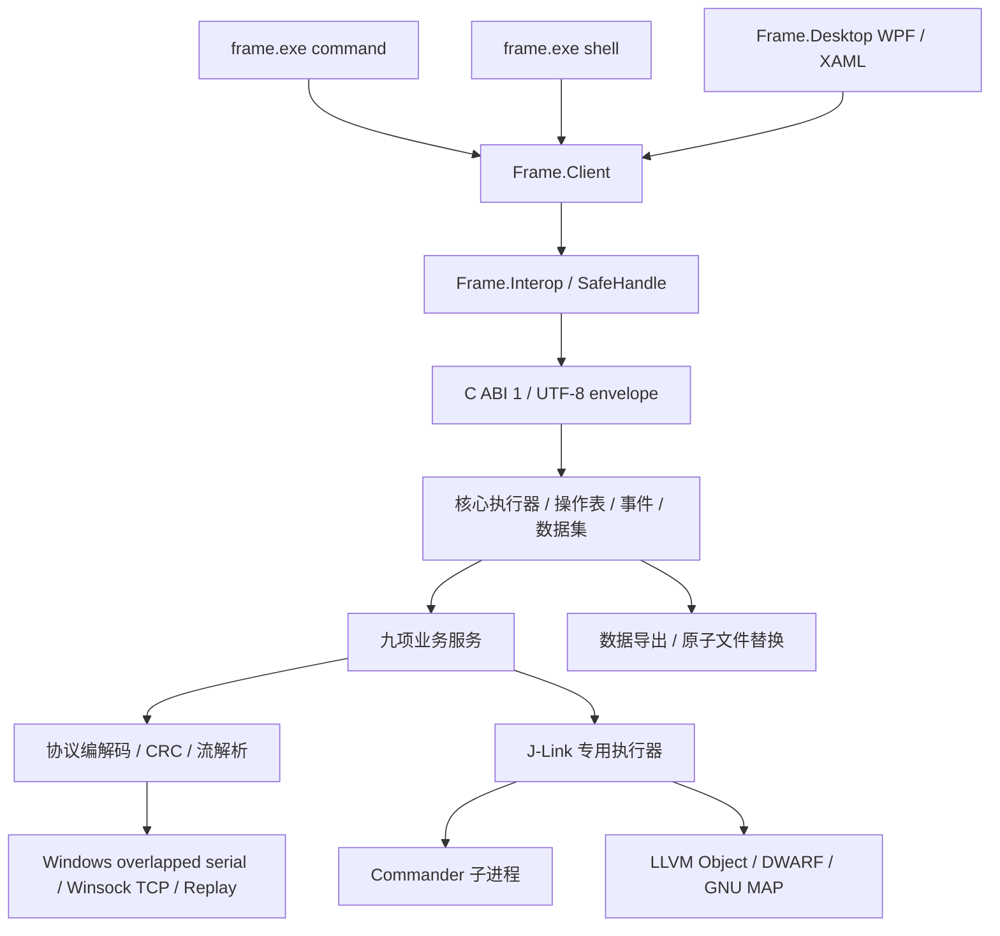

# FRAME 原生实现：Top Down

## 1. 产品与入口

目标是串口调试、参数读写、参数波形、Scope、SFRA、Perf、Trace、链表顺序与 J-Link 九项设备诊断任务。交付三个入口：C# Console CLI、同一命令定义的交互式 Shell、C# WPF/XAML 桌面工作台。所有入口通过 Frame.Client、Frame.Interop 访问同一个 C++20 DLL。

## 2. 应用接口

后续用户新增以太网连接要求：连接栏支持串口/TCP 切换，CLI/Shell 共用 transport=tcp、host、tcp_port。Winsock 使用非阻塞连接和有界读写，连接可取消；上层协议和业务服务复用原实现。当前为手动数字 IP 连接，不含自动发现。

C ABI 使用不透明实例句柄和 uint32/uint64，UTF-8 指令/结果带显式长度，调用方拥有输出缓冲区。`frame_submit` 只提交，`frame_result` 查询完成并复制结果，`frame_release` 显式释放。结果读取不消费；长度不足返回 2，可按 required 重新读取。SafeHandle 负责最终销毁。

`frame_snapshot` 返回连接 epoch、计数器、活动任务和数据集摘要。`frame_events` 按 sequence 游标批量读取完成事件，最多 256 个，事件环容量 1024，消费落后时明确报告 lost。取消走 `frame_cancel`，不使用跨语言回调。

应用接口 JSON 与设备协议分开：JSON 是带版本的进程内命令信封，设备链路仍按 E8/01 帧、显式小端字段和 CRC16 编解码。C# 不知道设备命令字、结构体布局或响应状态机。

## 3. 执行与生命周期

核心 jthread 串行维护串口业务状态，查询期间持续读取串口与分发采集报文。wave/trace 是可持续的后台任务，核心执行器可以同时处理参数查询、快照、数据分页等操作。J-Link 独立 jthread 串行持有符号索引和 Commander 生命周期，避免探针等待阻塞串口采集；RAM 写入与活动采集互斥。

Windows 串口使用 overlapped ReadFile/WriteFile、事件与 CancelIoEx；读取及写入都有等待边界。操作取消与截止时间贯穿等待路径。超时或取消的有限串口事务会使连接失效，下一次必须新建连接，以隔离缺少事务号协议中的迟到响应。

Frame.Client 的结果泵在后台线程运行，TaskCompletionSource 异步交付结果。WPF UI 线程只处理输入、表格与 ScottPlot 绘图，不同步等待设备。页面状态保存在窗口会话中，切页不销毁采集任务；关闭先取消任务、等待导出收尾，再在工作线程释放原生后端。

文件导出将数据集快照交给独立文件任务，使用 `.partial` 与原子替换保护完整文件。等待写入时核心继续读取串口，避免文件等待直接阻断采集；同一核心一次只执行一个导出，文件工作并发有界。

## 4. 数据模型与完整性

- 参数：名称、类型、原始位模式、显示值、上下限和标志；写入保留设备上下限并读回确认。
- 波形：名称、值、时间来源；批量帧校验 total/first/count，统计重复与缺样。设备计数器展开为 64 位时间；旧格式起止标记不当作数据。
- Scope：对象、通道、count/period/tag、按 index 排序的数据；获取期间 tag 改变则保留部分结果并报错。
- SFRA：对象、配置、sweep tag、频率/幅值/dB/相位；未就绪不拉取。
- Perf：字典 version、事务 sequence、record_id、结束记录数；拒绝重复、未知字典 ID 和版本不一致。
- Trace：设备 tick、展开时间、line，支持行号列表筛选。
- section：目录索引、list_id、node_count，节点保留设备实际索引与地址。
- J-Link：ELF 符号地址、大小、DWARF 类型以及结构体/数组成员；不猜测没有类型依据的写入大小。

数据集独立于操作结果存在，按 ID 分页读/导出/释放。有界历史淘汰量可见；部分拉取、取消和导出失败均保留可解释结果。容量和退出码见 CLI_REFERENCE.md。

## 5. 源码映射

| 目录 | 责任 |
|---|---|
| backend/include/frame | ABI 契约 |
| backend/src/protocol.* | 无平台依赖的字节编解码与业务负载解析 |
| backend/src/acquisition.hpp | 时间展开、批量数据完整性 |
| backend/src/transport.* | Windows 串口与独立回放适配 |
| backend/src/runtime.* | 任务、事件、数据集、执行器与关闭 |
| backend/src/services.cpp | 九项业务命令分派与事务 |
| backend/src/jlink.cpp、symbols.* | Commander 与 LLVM/GNU MAP |
| frontend/Frame.Interop | P/Invoke 与 SafeHandle |
| frontend/Frame.Client | 通用异步客户端 |
| frontend/Frame.Cli | System.CommandLine、Shell、JSON/NDJSON |
| frontend/Frame.Desktop | WPF/XAML、页面显示状态、表格、ScottPlot |
| tests/native、tests/fixtures | 协议/ABI/异常与独立数据样本 |
| tests/*.ps1 | CLI、Shell 与持续运行验证 |

## 6. 实施与验证顺序

P0 固定样本并验证 LLVM；P1 DLL/CLI；P2 串口参数；P3 Shell；P4 观测业务；P5 J-Link；P6 CLI 实机；P7 WPF；P8 视觉、生命周期、文档和清理。未来回归继续优先 CLI/Shell，只有布局、绘图或界面专属交互才开启 WPF。

新产品不包含 Python 应用/测试、不依赖 requirements 或 PyInstaller。LLVM 的构建系统可能探测第三方构建工具，相关需求不属于 FRAME 运行依赖。依赖版本由 CMake 与 NuGet lock 固定；构建输出在 build/app，当前不制作安装包。
